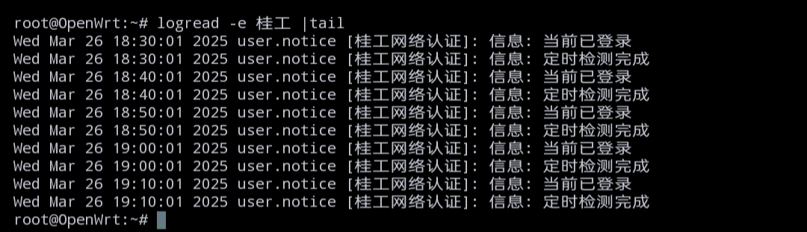

# 适用于桂林理工大学南宁分校的校园网自动登录脚本  
  
同样适用于哆点(DrCOM)认证，但可能需要自行修改登录参数  
思路参考：<https://www.cnblogs.com/1v7w/p/17642767.html>  
# 使用方法  
## 当前仅在openwrt测试通过  
1.下载脚本并移动至/etc/storage/GLUTNet.sh  
2.打开脚本并编辑账号密码  
3.打开路由器后台-系统-计划任务 添加一行  
> */10 * * * * /etc/storage/GLUTNet.sh
